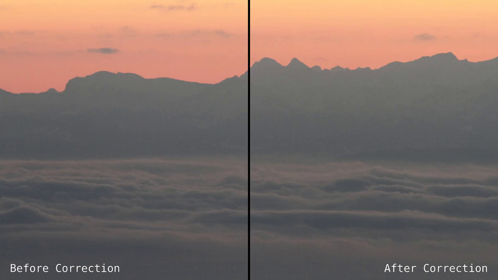

# deshake
A python script to de-shake timelapse (or video) based on
[scikit-image](http://scikit-image.org/).

## Story
The story of this little program starts somewhere in the Swiss mountains.
We were shooting a timelapse video with a tele-lens on a
very windy weather. The result video was completely shaky.

We decided to try to fix it by using the scikit-image library
which offers a precise translation detection method between two images.
[Read More](http://scikit-image.org/docs/dev/auto_examples/plot_register_translation.html)

We were quite impressed by the end result (click to view in Vimeo):

[](https://vimeo.com/158609239)


## Usage

    ./deshake.py INPUT_DIR [OUTPUT_DIR]

Usage if fairly simple, you just need to provide one input directory
with all your images. The second argument is optional (by default ```output```
is used as an output directory)

For instance, using our test example (the images have been released under a
[CC-by](https://creativecommons.org/licenses/by/3.0/) license):

    wget http://pmoret.ch/alpes.tgz
    tar xzvf alpes.tgz
    ./deshake.py alpes/ output/


